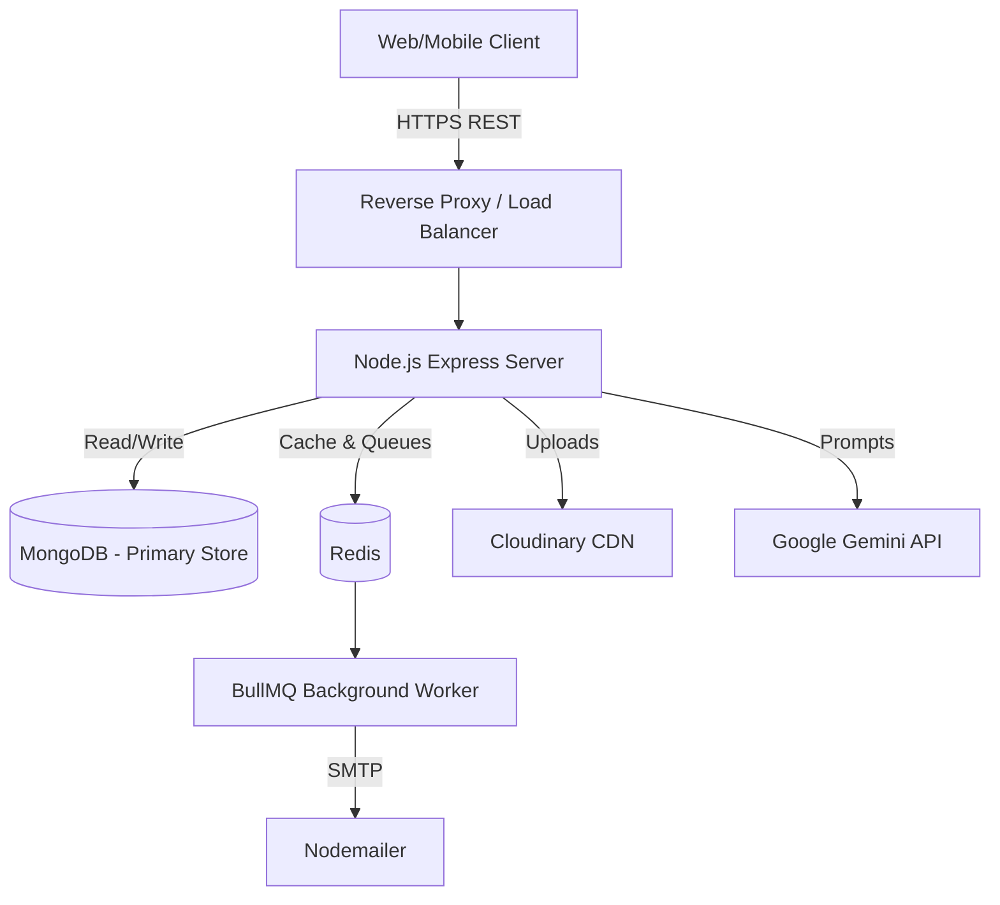

# System Architecture

## High-Level Overview

The SVITS ERP is built using a monolithic but highly modularized architecture to ensure simplicity in deployment while maintaining clean code separation.

## Directory Structure Design Pattern

We utilize the **Controller-Service-Model** pattern.
- **Models**: Defines Mongoose schemas, virtuals, and hooks (e.g., soft delete).
- **Controllers**: Validates HTTP requests, orchestrates standard HTTP responses, and handles edge errors. Business logic is deferred.
- **Services**: Contains reusable, domain-specific business logic (e.g., aggregating charts, processing AI inputs).
- **Middleware**: Intercepts requests for authentication, RBAC authorization, rate limiting, and security sanitization.
- **Utils**: Abstracted helpers (API features for pagination, Cloudinary uploaders, caching configs).

## Error Handling
Errors are caught synchronously using custom `ApiError` instances and asynchronously using an `asyncHandler` wrapper, which funnels all failures to a centralized `error.middleware.js` formatter.

## Security Posture
- XSS and NoSQL Injection sanitized universally via middleware.
- Passwords hashed via `bcryptjs`.
- JWT used for stateless authentication.
