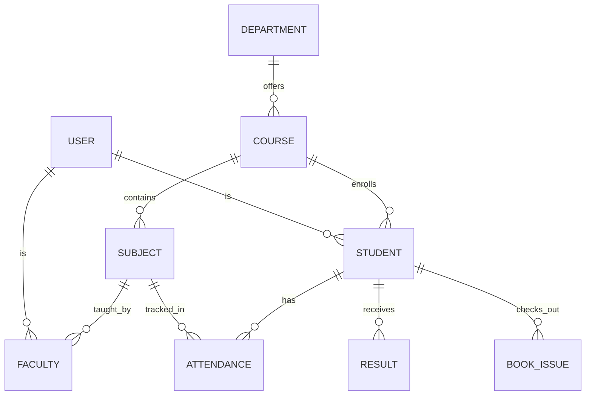

# Database Schema & Design

## Overview
The SVITS ERP utilizes MongoDB for flexible schema design, utilizing Mongoose ODM for type casting and validation.

## Entity Relationship Diagram (Core Modules)

## Optimizations & Design Choices
- **Soft Deletes**: Every document contains an `isActive: { type: Boolean, default: true }` field. A global `pre(/^find/)` hook ensures deleted records are omitted from generic queries.
- **Indexing**: 
  - Unique compound indices on `email` and `enrollmentNumber`.
  - Text indices on standard search fields (`name`, `description`) to optimize the global `$or` regex searches.
- **Aggregation Pipelines**: Used heavily in the dashboard controller to generate charts (e.g., grouping canteen orders by date using `$group` and `$match`).

## Document References
We prefer referencing (normalization) for relationships where the referenced document might change frequently (e.g., `Course` to `Department`), to avoid widespread updates. We use embedding for sub-documents that belong exclusively to a parent (e.g., timeline events in `ActivityLog`).
